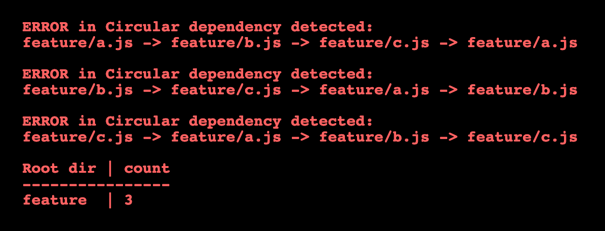
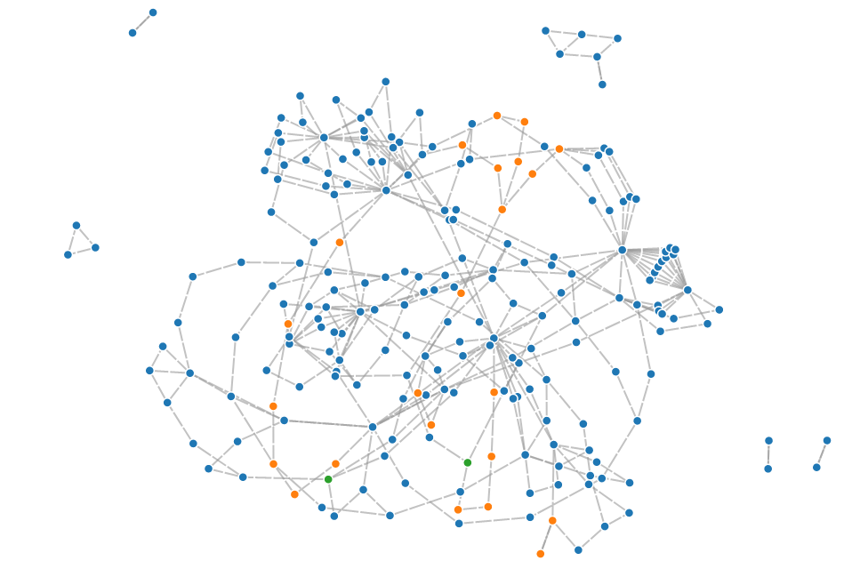
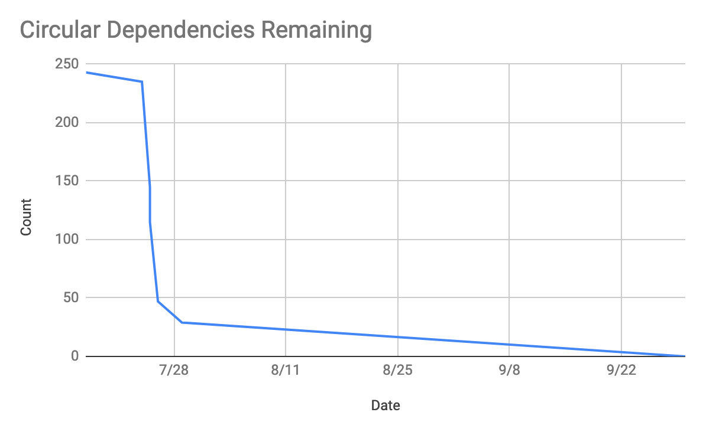

import Figure from '../../../components/Figure';
import Video from '../../../components/Video';

import directed from './images/directed.mp4';

# Breaking Up Circular Dependencies

One day at work, I set out to add a new utility function to a feature's utility file.

All of our new unit tests were passing, so I ran the entire test suite - and the same tests that were newly written, failed. I tried again, running just the utilities tests, and they succeeded. I ran the entire suite again - and they failed.

This behavior exhibited an underlying problem: Our system was not deterministic.

According to the error output, my new function was not defined. After 20 more minutes of debugging, I finally discovered what was going on: The utility file was part of a circular dependency chain.

Below, I dig into how I fixed the problem and set out to remove hundreds of circular dependencies from our main web application —all with the help of teammates, a new build configuration, and a little data visualization.

## The problem

Simply put, a circular dependency is when File A needs something from File B to run, while at the same time File B needs something from File A.
It's the chicken and the egg problem, and while computers don't have a default way to solve it, some programming languages have mechanisms that allow you to get away with it. The JavaScript environment I was working in is one of them.

Though circular dependencies can be intentionally added, it is often done unknowingly, which can lead to weird behavior like what I witnessed. The value was undefined initially, but later in the code execution, it became defined.

To solve my test problem, I reorganized some of the utilities into more appropriate files, which broke the dependency chain.

I ran the test suite, and all of them passed.

A couple of weeks later, I had a similar issue which would crash the site in another development environment. After a little digging around, I found, sure enough, that it was due to a circular dependency as well.

This made me wonder how many more problems were in the app and if they were creating bugs in the production site. It then became my goal to get rid of them.

## The solution

My first step was to measure the problem. I searched for ways to detect the circular dependencies in our app and found a great Webpack circular-dependency-plugin.

After installing it, I was surprised to find that our front end application included 238 offenses.

Knowing how many existed, I needed to make sure new ones weren't introduced during the fix. I added custom configuration to the plugin and hard-coded the number of offenses so that if any build resulted in more circular dependencies, it would fail. This allowed us time to fix the issue little by little and to avoid adding new circular dependencies during the process.

## The process

The plugin's messages spelled out the chains in a text format like `file-a.js -> file-b.js -> file-a.js`. I started looking through this list of 238 chains, but it was daunting to know where to start since the list wasn't in any helpful order. In the custom configuration, I added code to aggregate counts of the feature folder in which the chain started.

<Figure caption="Hundreds of lines of output was aggregated into counts per directory.">

</Figure>

This ended up being a great way to advertise to and enlist help from the other feature teams.

The team that owned the feature helped out with the chains in their feature. Fixing one sometimes had the effect of resolving multiple chains, which was encouraging. This all worked well for the simple dependency chains, but not all of them were so simple. This custom configuration is available in a Github Gist.

Some chains stretched several files, the longest of which spanned 32 files.

For some of these chains, there was a very clear resolution, but it was hard to find the easy solution (if there was one) for the longer chains. It was also hard to try to trace the values that needed to move from file to file. There were times when two chains would touch the same file. There was too much to mentally keep track of, and sometimes, the plugin's text output wasn't enough to paint the whole picture.

### Visualizing the problem

To offload the mental effort, I decided to make a visualization to better understand the issue, and hopefully identify where to make the optimal fix. I found some starter code for a D3 graph visualization, which I then edited for our use case.

<Figure caption="A visualization of all the files that are part of a circular dependency and their relationship.">

</Figure>

The nodes of the graph represented each file, and each connecting line had a small animation showing which file depended on the other.

This immediately showed me that many of these chains could intersect multiple times and share segments. These intersections were good places to start looking for the fix.

Initially, every file's node looked the same, so I assigned each a color depending on its feature folder.

This helped me see where global values were requiring feature-specific values, or when two distinct features needed values from each other. These were also signs that something could be organized better, breaking up the chain. I ended up abstracting this code into its own package so that others might be able to benefit from it as well (circular-dependency-plugin-visualizer).

<Figure
  caption="A detail of the visualization showing the direction of the dependency graph. The animation moves from the source file node to the importing file node."
>

<Video controls autoPlay muted loop>
  <source src={directed} type="video/mp4" />
</Video>

</Figure>

## Key themes identified

After refactoring dozens of files, a few themes stood out. Several issues emerged from having too many items defined in some of our Redux files. A pair of reducers would need constants from the other. The simplest solution was to make a third file by which the constants could both import.

Other problems came from having files that were split apart prematurely. There were pairs of files that were so intertwined that it only made sense to make them one file.

The final theme I saw included functions that did too much. Refactoring functions to have a single responsibility allowed the specific values to remain in their feature folder and generic operations to be defined in common places.

## Benefits to the team

In the end, we were able to successfully remove all 238 circular dependencies within a quarter.

I also left the circular-dependency-plugin installed so that if anyone adds another, it will immediately alert them, giving them the text output and the visualization to help them fix it.

Though it's difficult to measure the future benefits of this work, I know that existing bugs were fixed, hours of debugging time were spared, and we have greater confidence in our platform and development tools.

